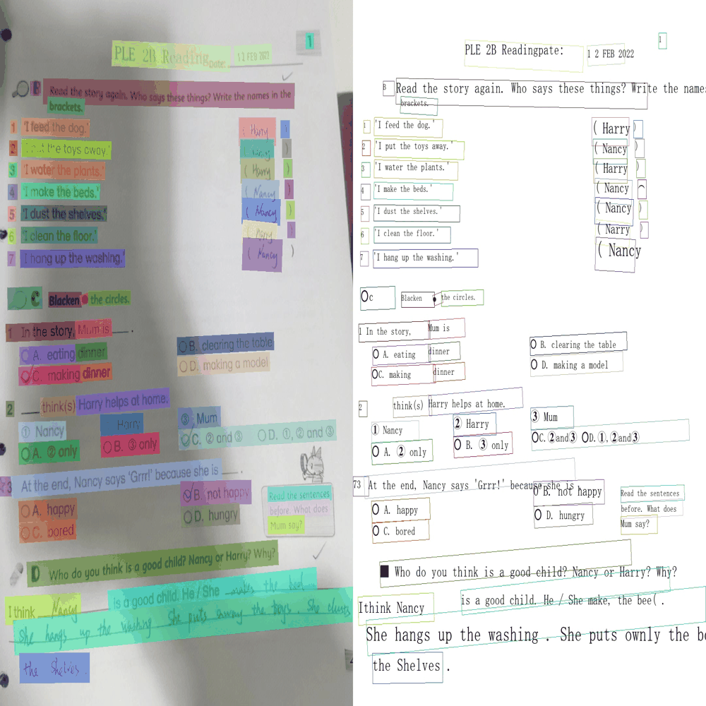

<!-- icon -->

[](https://github.com/puhuilab/phocr)
[](https://github.com/puhuilab/phocr)
[](https://github.com/puhuilab/phocr/issues)
[](https://github.com/puhuilab/phocr/issues)
[](https://pypi.org/project/phocr/)
[](https://pypi.org/project/phocr/)
[](https://pepy.tech/project/phocr)
[](https://pepy.tech/project/phocr)

# PHOCR: High-Performance OCR Toolkit

[English](README.md) | [简体中文](README_CN.md)

PHOCR is an open high-performance Optical Character Recognition (OCR) toolkit designed for efficient text recognition across multiple languages including Chinese, Japanese, Korean, Russian, Vietnamese, and Thai. **PHOCR features a completely custom-developed recognition model (PH-OCRv1) that significantly outperforms existing solutions.**

## Motivation

Current token-prediction-based model architectures are highly sensitive to the accuracy of contextual tokens. Repetitive patterns, even as few as a thousand instances, can lead to persistent memorization by the model. While most open-source text recognition models currently achieve character error rates (CER) in the percent range, our goal is to push this further into the per-mille range. At that level, for a system processing 100 million characters, the total number of recognition errors would be reduced to under 1 million — an order of magnitude improvement.

## Features

- **Custom Recognition Model**: **PH-OCRv1** achieves sub-0.x% character error rate in document-style settings by leveraging open-source models. Even achieves 0.0x% character error rate in English.
- **Multi-language Support**: Chinese, English, Japanese, Korean, Russian, and more
- **Rich Vocabulary**: Comprehensive vocabulary for each language. Chinese: 15,316, Korean: 17,388, Japanese: 11,186, Russian: 292.
- **High Performance**: Optimized inference engine with ONNX Runtime support
- **Easy Integration**: Simple Python API for quick deployment
- **Cross-platform**: Support for CPU and CUDA

## Visualization



## Installation

```bash
pip install phocr
```

### GPU Support (Optional)

If you want to use GPU acceleration with ONNX Runtime, you need to install cuDNN:

```bash
conda install -c nvidia cudnn=9
```

**Note**: Without this dependency, you may encounter errors when using ONNX Runtime with GPU support.

## Quick Start

```python
from phocr import PHOCR

# Initialize OCR engine
engine = PHOCR()

# Perform OCR on image
result = engine("path/to/image.jpg")
print(result)

# Visualize results
result.vis("output.jpg")
print(result.to_markdown())
```

## Benchmarks

We conducted comprehensive benchmarks comparing PHOCR with leading OCR solutions across multiple languages and scenarios. **Our custom-developed PH-OCRv1 model demonstrates significant improvements over existing solutions.**

### Overall Performance Comparison

<table style="width: 90%; margin: auto; border-collapse: collapse; font-size: small;">
  <thead>
    <tr>
      <th rowspan="2">Model</th>
      <th colspan="4">ZH & EN<br><span style="font-weight: normal; font-size: x-small;">CER ↓</span></th>
      <th colspan="2">JP<br><span style="font-weight: normal; font-size: x-small;">CER ↓</span></th>
      <th colspan="2">KO<br><span style="font-weight: normal; font-size: x-small;">CER ↓</span></th>
      <th colspan="1">RU<br><span style="font-weight: normal; font-size: x-small;">CER ↓</span></th>
    </tr>
    <tr>
      <th><i>English</i></th>
      <th><i>Simplified Chinese</i></th>
      <th><i>EN CH Mixed</i></th>
      <th><i>Traditional Chinese</i></th>
      <th><i>Document</i></th>
      <th><i>Scene</i></th>
      <th><i>Document</i></th>
      <th><i>Scene</i></th>
      <th><i>Document</i></th>
    </tr>
  </thead>
  <tbody>
    <tr>
      <td>PHOCR</td>
      <td><strong>0.0008</strong></td>
      <td><strong>0.0057</strong></td>
      <td><strong>0.0171</strong></td>
      <td><strong>0.0145</strong></td>
      <td><strong>0.0039</strong></td>
      <td><strong>0.0197</strong></td>
      <td><strong>0.0050</strong></td>
      <td><strong>0.0255</strong></td>
      <td><strong>0.0046</strong></td>
    </tr>
    <tr>
      <td>Baidu</td>
      <td>0.0014</td>
      <td>0.0069</td>
      <td>0.0354</td>
      <td>0.0431</td>
      <td>0.0222</td>
      <td>0.0607</td>
      <td>0.0238</td>
      <td>0.212</td>
      <td>0.0786</td>
    </tr>
    <tr>
      <td>Ali</td>
      <td>-</td>
      <td>-</td>
      <td>-</td>
      <td>-</td>
      <td>0.0272</td>
      <td>0.0564</td>
      <td>0.0159</td>
      <td>0.102</td>
      <td>0.0616</td>
    </tr>
    <tr>
      <td>PP-OCRv5</td>
      <td>0.0149</td>
      <td>0.0226</td>
      <td>0.0722</td>
      <td>0.0625</td>
      <td>0.0490</td>
      <td>0.1140</td>
      <td>0.0113</td>
      <td>0.0519</td>
      <td>0.0348</td>
    </tr>
  </tbody>
</table>


Notice

- baidu: [Baidu Accurate API](https://ai.baidu.com/tech/ocr/general)
- Ali: [Aliyun API](https://help.aliyun.com/zh/ocr/product-overview/recognition-of-characters-in-languages-except-for-chinese-and-english-1)
- CER: the total edit distance divided by the total number of characters in the ground truth.


## Advanced Usage

With global KV cache enabled, we implement a simple version using PyTorch (CUDA). When running with torch (CUDA), you can enable caching by setting `use_cache=True` in `ORTSeq2Seq(...)`, which also allows for larger batch sizes.

### Language-specific Configuration

See [demo.py](./demo.py) for more examples.

## Evaluation & Benchmarking

PHOCR provides comprehensive benchmarking tools to evaluate model performance across different languages and scenarios.

### Quick Benchmark

Run the complete benchmark pipeline:
```bash
sh benchmark/run_recognition.sh
```

Calculate Character Error Rate (CER) for model predictions:
```bash
sh benchmark/run_score.sh
```

### Benchmark Datasets

PHOCR uses standardized benchmark datasets for fair comparison:

- **zh_en_rec_bench** [Chinese & English mixed text recognition](https://huggingface.co/datasets/puhuilab/zh_en_rec_bench)
- **jp_rec_bench** [Japanese text recognition](https://huggingface.co/datasets/puhuilab/jp_rec_bench)
- **ko_rec_bench** [Korean text recognition](https://huggingface.co/datasets/puhuilab/ko_rec_bench)
- **ru_rec_bench** [Russian text recognition](https://huggingface.co/datasets/puhuilab/ru_rec_bench)

Chinese & English mixed text recognition is mainly from [OmniDocBench](https://github.com/opendatalab/OmniDocBench) and [TC-STR](https://github.com/esun-ai/traditional-chinese-text-recogn-dataset).
Other datasets are collected by our team manually.

## Further Improvements

- Character error rate (CER), including punctuation, can be further reduced through additional normalization of the training corpus.
- Text detection accuracy can be further enhanced by employing a more advanced detection framework.

## Contributing

We welcome contributions! Please feel free to submit issues, feature requests, or pull requests.

## Support

For questions and support, please open an issue on GitHub or contact the maintainers.

## Acknowledgements

Many thanks to [RapidOCR](https://github.com/RapidAI/RapidOCR) for detection and main framework.

## License

- This project is released under the Apache 2.0 license
- The copyright of the OCR detection and classification model is held by Baidu
- The PHOCR recognition models are under the modified MIT License - see the [LICENSE](./LICENSE) file for details

## Citation

If you use PHOCR in your research, please cite:

```bibtex
@misc{phocr2025,
  title={PHOCR: High-Performance OCR Toolkit},
  author={PuHui Lab},
  year={2025},
  url={https://github.com/puhuilab/phocr}
}
```