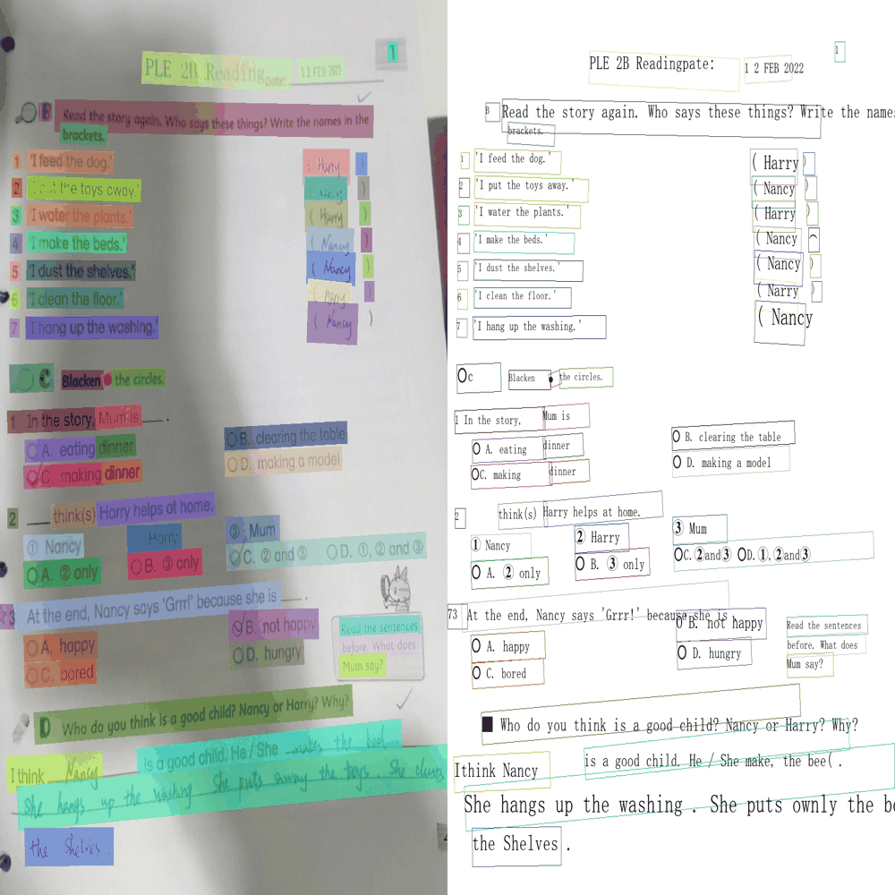

<!-- icon -->

[](https://github.com/puhuilab/phocr)
[](https://github.com/puhuilab/phocr)
[](https://github.com/puhuilab/phocr/issues)
[](https://github.com/puhuilab/phocr/issues)
[](https://pypi.org/project/phocr/)
[](https://pypi.org/project/phocr/)
[](https://pepy.tech/project/phocr)
[](https://pepy.tech/project/phocr)


# PHOCR：高性能文字识别工具包

[English](README.md) | [简体中文](README_CN.md)

PHOCR 是一个高性能的开源光学字符识别（OCR）工具包，专为多语种文本识别任务设计，支持包括中文、日文、韩文、俄文、越南文和泰文在内的多种语言。**PHOCR 搭载了我们完全自研的识别模型 PH-OCRv1，在准确率上显著优于现有解决方案。**

## 背景动机

当前基于下一个 token 预测的模型结构对上下文 token 的准确性非常敏感。即使仅有千次重复的模式，也可能导致模型产生永久性记忆。虽然大多数开源文字识别模型目前的字符错误率（CER）仍处于百分位水平，我们的目标是将其进一步提升至千分位（0.x%）。在这一精度下，对于处理 1 亿字符的系统，总错误字符数将下降至100万内，达到数量级的准确率提升。

## 主要特性

- **自研识别模型**：**PH-OCRv1**，可在文档场景中实现千分位CER，英文场景下甚至可达0.0x%。
- **多语种支持**：支持中文、英文、日文、韩文、俄文等多种语言。
- **丰富词表覆盖**：中文 15316，韩文 17388，日文 11186，俄文 292。
- **高性能推理**：深度优化的模型结构，集成 ONNX Runtime 支持。
- **轻松集成**：提供简洁的 Python API。
- **跨平台**：支持 CPU 与 CUDA 环境。

## 可视化效果



## 安装方式

```bash
pip install phocr
```

## 快速开始

```python
from phocr import PHOCR

# 初始化 OCR 引擎
engine = PHOCR()

# 对图像进行 OCR 识别
result = engine("path/to/image.jpg")
print(result)

# 可视化结果
result.vis("output.jpg")
print(result.to_markdown())
```

## 性能基准测试

我们进行了全面的基准测试，将 PHOCR 与领先的 OCR 解决方案在多种语言和场景下进行比较。**我们自研的 PH-OCRv1 模型在现有解决方案基础上实现了显著改进。**

### 整体性能对比

<table style="width: 90%; margin: auto; border-collapse: collapse; font-size: small;">
  <thead>
    <tr>
      <th rowspan="2">模型</th>
      <th colspan="4">中文 & 英文<br><span style="font-weight: normal; font-size: x-small;">CER ↓</span></th>
      <th colspan="2">日文<br><span style="font-weight: normal; font-size: x-small;">CER ↓</span></th>
      <th colspan="2">韩文<br><span style="font-weight: normal; font-size: x-small;">CER ↓</span></th>
      <th colspan="1">俄文<br><span style="font-weight: normal; font-size: x-small;">CER ↓</span></th>
    </tr>
    <tr>
      <th><i>英文</i></th>
      <th><i>简体中文</i></th>
      <th><i>中英混合</i></th>
      <th><i>繁体中文</i></th>
      <th><i>文档</i></th>
      <th><i>场景</i></th>
      <th><i>文档</i></th>
      <th><i>场景</i></th>
      <th><i>文档</i></th>
    </tr>
  </thead>
  <tbody>
    <tr>
      <td>PHOCR</td>
      <td><strong>0.0008</strong></td>
      <td><strong>0.0057</strong></td>
      <td><strong>0.0171</strong></td>
      <td><strong>0.0145</strong></td>
      <td><strong>0.0039</strong></td>
      <td><strong>0.0197</strong></td>
      <td><strong>0.0050</strong></td>
      <td><strong>0.0255</strong></td>
      <td><strong>0.0046</strong></td>
    </tr>
    <tr>
      <td>百度</td>
      <td>0.0014</td>
      <td>0.0069</td>
      <td>0.0354</td>
      <td>0.0431</td>
      <td>0.0222</td>
      <td>0.0607</td>
      <td>0.0238</td>
      <td>0.212</td>
      <td>0.0786</td>
    </tr>
    <tr>
      <td>阿里</td>
      <td>-</td>
      <td>-</td>
      <td>-</td>
      <td>-</td>
      <td>0.0272</td>
      <td>0.0564</td>
      <td>0.0159</td>
      <td>0.102</td>
      <td>0.0616</td>
    </tr>
    <tr>
      <td>PP-OCRv5</td>
      <td>0.0149</td>
      <td>0.0226</td>
      <td>0.0722</td>
      <td>0.0625</td>
      <td>0.0490</td>
      <td>0.1140</td>
      <td>0.0113</td>
      <td>0.0519</td>
      <td>0.0348</td>
    </tr>
  </tbody>
</table>

说明:

- baidu: [Baidu Accurate API](https://ai.baidu.com/tech/ocr/general)
- Ali: [Aliyun API](https://help.aliyun.com/zh/ocr/product-overview/recognition-of-characters-in-languages-except-for-chinese-and-english-1)
- 字符错误率（CER）：总的编辑距离除以真实标签（ground truth）中字符的总数量。

## 高级用法

启用全局 KV 缓存后，我们使用 PyTorch (CUDA) 实现了一个简单版本。在使用 torch (CUDA) 运行时，您可以通过在 `ORTSeq2Seq(...)` 中设置 `use_cache=True` 来启用缓存，这也允许更大的批处理大小。

### 语言特定配置

更多示例请参见 [demo.py](./demo.py)。

## 评估与基准测试

PHOCR 提供全面的基准测试工具，用于评估模型在不同语言和场景下的性能。

### 快速基准测试

运行完整的基准测试流程：
```bash
sh benchmark/run_recognition.sh
```

计算模型预测的字符错误率 (CER)：
```bash
sh benchmark/run_score.sh
```

### 基准测试数据集

PHOCR 使用标准化的基准测试数据集进行公平比较：

- **zh_en_rec_bench** [中英文混合文本识别](https://huggingface.co/datasets/puhuilab/zh_en_rec_bench)
- **jp_rec_bench** [日文文本识别](https://huggingface.co/datasets/puhuilab/jp_rec_bench)
- **ko_rec_bench** [韩文文本识别](https://huggingface.co/datasets/puhuilab/ko_rec_bench)
- **ru_rec_bench** [俄文文本识别](https://huggingface.co/datasets/puhuilab/ru_rec_bench)

中英文混合文本识别主要来自于[OmniDocBench](https://github.com/opendatalab/OmniDocBench)和[TC-STR](https://github.com/esun-ai/traditional-chinese-text-recogn-dataset)的随机采样。其它数据由我们的团队手工采集完成。

## 后续优化方向

- 通过进一步归一化训练语料，字符错误率（CER，包括标点符号）可以得到进一步降低。
- 通过采用更先进的检测框架，文字检测的准确率可以进一步提升。

## 贡献指南

我们欢迎任何贡献！请随时提交 issue、功能请求或 pull request。

## 支持

如有问题或需要支持，请在 GitHub 上提交 issue 或联系维护者。

## 鸣谢

特别感谢 [RapidOCR](https://github.com/RapidAI/RapidOCR) 提供的检测模型及主框架支持。

## 许可证

- 本项目采用 Apache 2.0 开源许可证
- OCR 检测和分类模型的版权归百度所有
- PHOCR 识别模型采用修改版 MIT 许可证，详情请见 [LICENSE](./LICENSE) 文件

## 引用方式

如果您在研究中使用了 PHOCR，请引用：

```bibtex
@misc{phocr2025,
  title={PHOCR: High-Performance OCR Toolkit},
  author={PuHui Lab},
  year={2025},
  url={https://github.com/puhuilab/phocr}
}
```